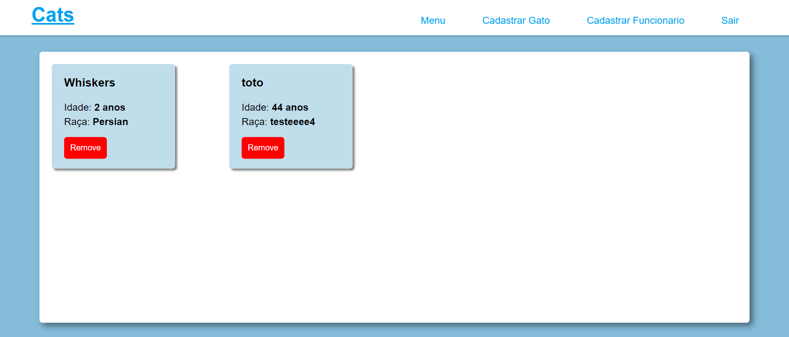

# Cats



> Este aplicativo de petshop permite aos usuários adicionar novos gatos à lista de atendimento e excluir os já existentes. O acesso requer login com uma conta previamente criada, proporcionando uma gestão eficiente da clientela felina da petshop.

### stack utilizada

- [x] Angular.
- [x] NestJS.
- [x] Docker.
- [x] SQLite.

### Ajustes e melhorias

O projeto ainda está em desenvolvimento e as próximas atualizações serão voltadas nas seguintes tarefas:

- [ ] enviar o token do front pro back pra acessar as rotas protegidas.
- [ ] adicionar permissão do tipo user ou admim para criação de novos usuarios.
- [ ] proteger rotas para que só seja possivel o acesso quando estiver autenticado.
- [ ] só mostrar o header quando estiver autenticado.

## 💻 Pré-requisitos

Antes de começar, verifique se você atendeu aos seguintes requisitos:

- Você instalou o `<angular  17.0.3>`
- Você instalou o `<nest.js  latest>`
- Você instalou o `<node  20.10.0>`

## 🚀 Instalando <Cats>

Para instalar o <Cats>, siga estas etapas:

Frontend:
 Na pasta onte esta o frontend execute os seguintes comandos:

```
<npm install>
<ng serve>
```
abra o projeto no navegador em `http://localhost:4200/`

Backend:
 Na pasta onte esta o backend execute os seguintes comandos:

```
<npm install>
<npm run start:dev>
```
abra o projeto no navegador em `http://localhost:3000/`

## ☕ Usando <Cats>

Para usar <Cats>, efetue o login com as credenciais abaixo:

```
<login: admin>
<email: admin@admin.com>
<senha: Senhaforte1@>
```
